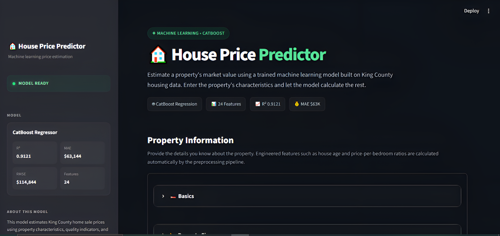
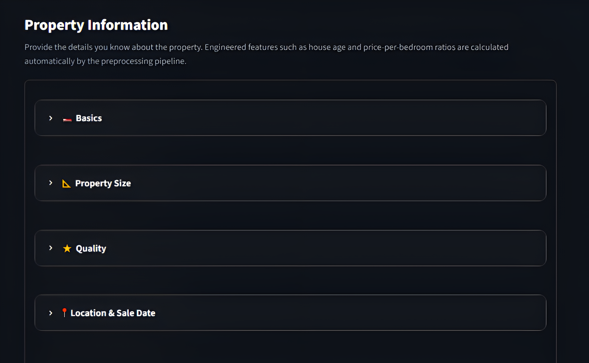
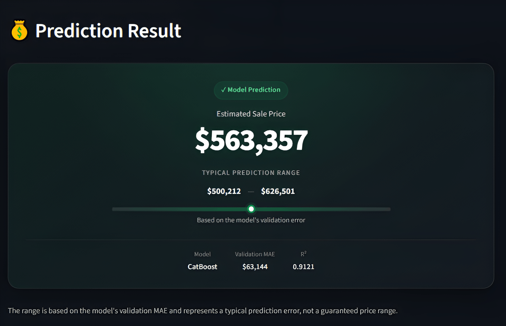

# 🏠 House Price Prediction

<p align="center">
  <b>A machine learning application that predicts residential property prices using the King County house sales dataset.</b>
</p>

<p align="center">
  Data Analysis • Feature Engineering • Model Comparison • CatBoost • Streamlit
</p>

---

## 📖 Overview

**House Price Prediction** is an end-to-end machine learning project that predicts residential property prices using historical housing data from **King County**.

The project covers the complete machine learning workflow:

**Data Exploration → Data Cleaning → Feature Engineering → Model Training → Evaluation → Prediction → Web Application**

The final model uses **26 features**, while the Streamlit application only asks users for meaningful real-world property information. Engineered features are automatically generated through the same preprocessing logic used during model development.

This keeps the prediction workflow consistent and prevents users from having to manually calculate derived features.

---

## 🎯 Prediction Pipeline

```text
┌──────────────────────┐
│      User Input      │
│ Property Information │
└──────────┬───────────┘
           │
           ▼
┌──────────────────────┐
│  Feature Engineering │
│ src/preprocessing.py │
└──────────┬───────────┘
           │
           ▼
┌──────────────────────┐
│    CatBoost Model    │
│  house_price_model   │
└──────────┬───────────┘
           │
           ▼
┌──────────────────────┐
│    src/predict.py    │
│   Prediction Logic   │
└──────────┬───────────┘
           │
           ▼
┌──────────────────────┐
│   Predicted Price    │
└──────────────────────┘
```

The preprocessing logic is centralized so that the features used during prediction remain consistent with those used during model training.

---

## 📸 Screenshots

### 🖥️ Prediction Interface



### 🖥️ Application View



### 🖥️ Prediction Result



---

## 📊 Model Performance

The final **CatBoostRegressor** was evaluated using an **80/20 train-test split**.

| Metric   |          Result |
| -------- | --------------: |
| **MAE**  |  **$63,020.69** |
| **RMSE** | **$113,638.49** |
| **R²**   |      **0.9140** |

### Dataset Split

| Dataset          |   Rows |
| ---------------- | -----: |
| Original dataset | 21,613 |
| Cleaned dataset  | 21,612 |
| Training samples | 17,289 |
| Testing samples  |  4,323 |

The final model achieved an **R² of 0.9140**, meaning it explains approximately **91.4% of the variance** in house prices within the test set.

---

## 🤖 Model Development

Multiple models were evaluated during development to establish a baseline and measure the impact of more advanced algorithms and feature engineering.

### 1. Linear Regression — Baseline

| Metric   |      Result |
| -------- | ----------: |
| **MAE**  | $125,890.46 |
| **RMSE** | $210,245.75 |
| **R²**   |      0.7055 |

The linear regression model established a baseline for comparison.

### 2. Tree-Based Model

| Metric   |      Result |
| -------- | ----------: |
| **MAE**  |  $72,707.68 |
| **RMSE** | $145,823.87 |
| **R²**   |      0.8583 |

The tree-based approach substantially improved performance over the linear baseline by capturing non-linear relationships between property characteristics and price.

### 3. CatBoost — Final Model

| Metric   |          Result |
| -------- | --------------: |
| **MAE**  |  **$63,020.69** |
| **RMSE** | **$113,638.49** |
| **R²**   |      **0.9140** |

The final CatBoost model provided the strongest performance across all evaluated metrics.

### 📈 Model Comparison

| Model             |            MAE |            RMSE |         R² |
| ----------------- | -------------: | --------------: | ---------: |
| Linear Regression |    $125,890.46 |     $210,245.75 |     0.7055 |
| Tree-Based Model  |     $72,707.68 |     $145,823.87 |     0.8583 |
| **CatBoost**      | **$63,020.69** | **$113,638.49** | **0.9140** |

The progression demonstrates the impact of moving from a simple linear baseline toward tree-based learning and feature engineering.

---

## 🧠 Feature Engineering

Feature engineering is handled centrally in:

```text
src/preprocessing.py
```

The project derives additional features from the original dataset.

| Feature                   | Formula                      |
| ------------------------- | ---------------------------- |
| `sale_year`               | Year extracted from `date`   |
| `sale_month`              | Month extracted from `date`  |
| `house_age`               | `sale_year - yr_built`       |
| `years_since_renovation`  | `sale_year - yr_renovated`   |
| `total_sqft`              | `sqft_above + sqft_basement` |
| `living_to_lot_ratio`     | `sqft_living / sqft_lot`     |
| `living_sqft_per_bedroom` | `sqft_living / bedrooms`     |
| `bathrooms_per_bedroom`   | `bathrooms / bedrooms`       |

Additional preprocessing includes:

* Handling invalid and infinite values
* Filling missing values in engineered per-bedroom features
* Removing raw `id` and `date` columns before model inference

Centralizing this logic helps prevent inconsistencies between training and production prediction.

---

## 🔎 Feature Importance

Feature importance was analyzed using the final CatBoost model.

| Feature         | Importance |
| --------------- | ---------: |
| `lat`           |     22.749 |
| `long`          |     13.452 |
| `grade`         |     10.872 |
| `zipcode`       |      9.534 |
| `total_sqft`    |      8.268 |
| `sqft_living`   |      8.110 |
| `sqft_above`    |      4.014 |
| `sqft_living15` |      3.751 |
| `view`          |      3.600 |
| `waterfront`    |      3.488 |

The results indicate that **location, construction grade, and property size** are particularly influential factors in the model's predictions.

---

## 📁 Project Structure

```text
House-Price-Prediction/
│
├── app/
│   └── app.py                     # Streamlit application
│
├── data/
│   └── raw/
│       └── kc_house_data.csv      # Raw dataset
│
├── models/
│   └── house_price_model.cbm      # Trained CatBoost model
│
├── notebooks/
│   └── 01_exploration.ipynb       # EDA, experiments & evaluation
│
├── src/
│   ├── predict.py                 # Prediction logic
│   └── preprocessing.py           # Feature engineering & preprocessing
│
├── screenshots/
│   ├── Screenshot_1.png
│   ├── Screenshot_2.png
│   └── Screenshot_3.png
│
├── .gitignore
├── requirements.txt
└── README.md
```

### 🔑 Main Components

#### `notebooks/01_exploration.ipynb`

Contains:

* Exploratory data analysis
* Data cleaning
* Feature engineering experiments
* Model training
* Model comparison
* Evaluation
* Feature importance analysis

#### `src/preprocessing.py`

Contains the reusable feature engineering and preprocessing logic used by the prediction pipeline.

#### `src/predict.py`

Loads the trained CatBoost model and exposes the `predict_price()` function used by the Streamlit application.

#### `models/house_price_model.cbm`

Contains the trained CatBoost regression model.

#### `app/app.py`

Contains the Streamlit interface used to collect property information and display predictions.

---

## 🖥️ Streamlit Application

The prediction interface is organized into four sections to keep the input experience simple.

### 🛏️ Basics

Users provide:

* Bedrooms
* Bathrooms
* Floors
* Waterfront status
* View quality

### 📐 Size

Users provide:

* Living area
* Lot size
* Above-ground area
* Basement area
* Average living area of nearby homes
* Average lot size of nearby homes

### ⭐ Quality

Users provide:

* Overall condition
* Construction/design grade

### 📍 Location & Sale Date

Users provide:

* Zip code
* Latitude
* Longitude
* Year built
* Renovation information
* Sale date

The application automatically calculates the engineered features required by the model.

---

## 🔄 How Prediction Works

When the user clicks **Predict House Price**:

1. Streamlit collects the property information.
2. The application creates the raw feature dictionary.
3. `predict.py` passes the data to the preprocessing pipeline.
4. `preprocessing.py` generates the engineered features.
5. The processed data is passed to the trained CatBoost model.
6. CatBoost generates the predicted price.
7. Streamlit displays the estimated house price.

```text
User Input
    ↓
Raw Feature Dictionary
    ↓
Preprocessing
    ↓
Feature Engineering
    ↓
CatBoostRegressor
    ↓
Predicted Price
    ↓
Streamlit UI
```

Keeping preprocessing separate from the UI makes the prediction pipeline easier to maintain, test, and reuse.

---

## 🧪 Data Cleaning

The original dataset contains **21,613 records**.

During exploratory analysis, an extreme outlier containing **33 bedrooms** was identified and removed.

```text
Original rows: 21,613
Cleaned rows:  21,612
```

The cleaned dataset was then used for model development and evaluation.

---

## 🛠️ Technologies

| Technology          | Purpose                                         |
| ------------------- | ----------------------------------------------- |
| 🐍 **Python**       | Core programming language                       |
| 🐼 **Pandas**       | Data manipulation and analysis                  |
| 🔢 **NumPy**        | Numerical computation                           |
| 📊 **Scikit-learn** | Model evaluation and machine learning utilities |
| 🤖 **CatBoost**     | Final gradient boosting regression model        |
| 📈 **Matplotlib**   | Data visualization                              |
| 📊 **Seaborn**      | Statistical visualization                       |
| 📓 **Jupyter**      | Data exploration and experimentation            |
| 🌐 **Streamlit**    | Interactive prediction web application          |

---

## ⚙️ Installation

### Prerequisites

Make sure you have:

* **Python 3.9+**
* `pip`
* Git

### 1. Clone the Repository

```bash
git clone <your-repository-url>

cd House-Price-Prediction
```

### 2. Create a Virtual Environment

On Windows:

```powershell
python -m venv .venv
```

Activate the environment:

```powershell
.venv\Scripts\activate
```

### 3. Install Dependencies

```bash
pip install -r requirements.txt
```

---

## 🚀 Run the Application

From the project root:

```bash
streamlit run app/app.py
```

The application will open in your default browser.

The Streamlit application loads the trained model from:

```text
models/house_price_model.cbm
```

---

## ⚠️ Limitations

This project has several limitations:

* The model is trained on historical **King County** housing data.
* Predictions may not generalize well to other geographic markets.
* Location-related features such as latitude, longitude, and zipcode have a significant influence on predictions.
* Prediction quality depends on the accuracy of the information provided by the user.
* The model should not be considered a professional property appraisal or financial valuation.
* The model does not account for future market conditions or economic changes.

---

## 🔮 Future Improvements

Potential improvements include:

* 🔬 K-fold cross-validation
* ⚙️ Automated hyperparameter optimization
* 🗺️ Advanced geospatial feature engineering
* 📊 Prediction intervals and uncertainty estimates
* 🧪 Automated unit tests for preprocessing and prediction
* 🔍 Improved model explainability
* 📈 Model monitoring and performance tracking
* 🚀 Cloud deployment
* 🔄 CI/CD pipeline
* ✅ Stronger input validation

---

## 📚 Dataset

This project uses the **King County House Sales** dataset commonly distributed through Kaggle.

The dataset contains historical property sales information, including:

* Property size
* Location
* Bedrooms
* Bathrooms
* Condition
* Construction grade
* Waterfront status
* View quality
* Sale date
* And other property characteristics

---

## 🎯 Project Goals

This project was developed as a practical machine learning portfolio project with an emphasis on building an **end-to-end prediction system**, rather than stopping at model training.

Key areas demonstrated include:

* 📊 Exploratory data analysis
* 🧹 Data cleaning
* 🧠 Feature engineering
* 🤖 Model experimentation and comparison
* 🌳 Gradient boosting
* 📏 Model evaluation
* ♻️ Reusable preprocessing
* 🧩 Separation of ML logic from application code
* 🌐 Machine learning deployment through Streamlit

---

## 📄 License

This project is available for **educational and portfolio purposes**.